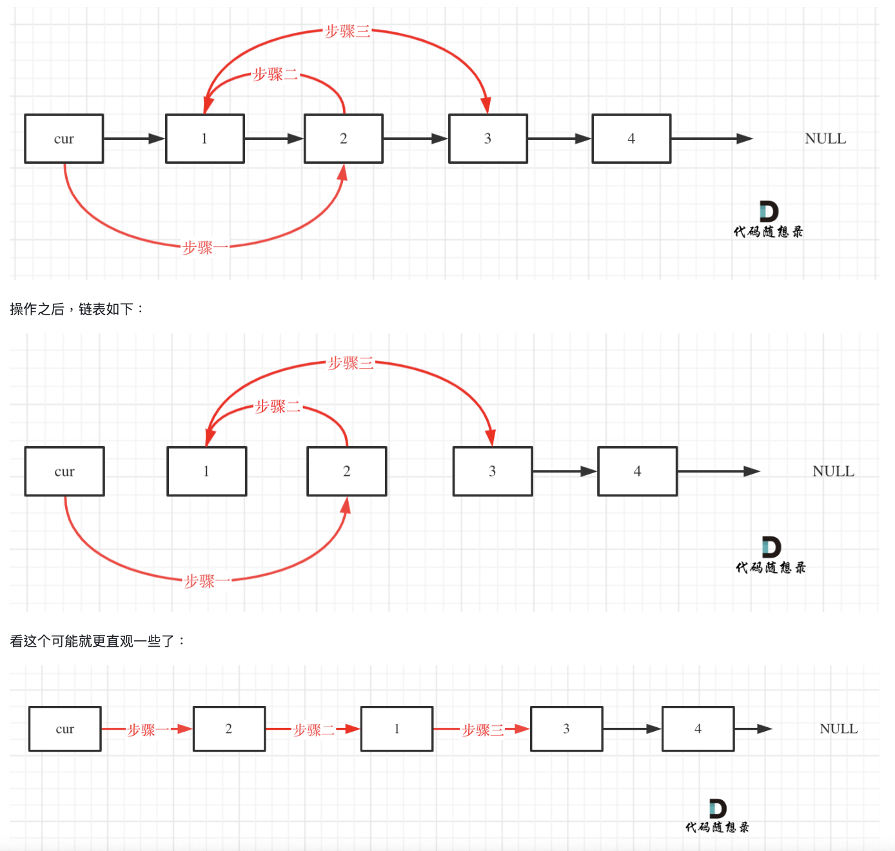

<style>
.circle-title {
    display: inline-block;
    padding: 10px;
    border: 2px solid black;
    border-radius: 50%;
    text-align: center;
}
</style>


# 算法重點
## 性能分析:
大O用来表示上界的，当用它作为算法的最坏情况运行时间的上界，就是对任意数据输入的运行时间的上界。

## 數組:
<h1 class="circle-title">二分搜尋</h1>
<div style="text-align: center;">
#704
</div>

二分查找涉及的很多的边界条件，逻辑比较简单，但就是写不好。例如到底是 WHILE(LEFT < RIGHT) 还 是 WHILE(LEFT <= RIGHT)，到底是RIGHT = MIDDLE呢，还是要RIGHT = MIDDLE - 1呢?

写二分法，区间的定义一般为两种，左闭右闭即[LEFT, RIGHT]，或者左闭右开即[LEFT, RIGHT)。 

*二分法第一种写法:*

第一种写法，我们定义 TARGET 是在一个在左闭右闭的区间里，也就是[LEFT, RIGHT] (这个很重要非常重要)。
区间的定义这就决定了二分法的代码应该如何写，因为定义TARGET在[LEFT, RIGHT]区间，所以有如下两 点:

1. WHILE (LEFT <= RIGHT) 要使用 <= ，因为LEFT == RIGHT是有意义的，所以使用 <=

2. IF (NUMS[MIDDLE] > TARGET) RIGHT 要赋值为 MIDDLE - 1，因为当前这个NUMS[MIDDLE]一定不
是TARGET，那么接下来要查找的左区间结束下标位置就是 MIDDLE - 1

```python
class Solution:
    def search(self, nums: List[int], target: int) -> int:
        left, right = 0, len(nums) - 1 # 定义target在左闭右闭的区间里，[left, right]
        while left <= right:
            middle = left + (right - left) // 2

            if nums[middle] > target:
            right = middle - 1 # target在左区间，所以[left, middle - 1]
            elif nums[middle] < target:
            left = middle + 1 # target在右区间，所以[middle + 1, right]
            else:
            return middle # 数组中找到目标值，直接返回下标
        return -1 # 未找到目标值
```

*二分法第二种写法:*

如果说定义 target 是在一个在左闭右开的区间里，也就是[left, right) ，那么二分法的边界处理方式 则截然不同。

有如下两点:
1. while (left < right)，这里使用 < ,因为left == right在区间[left, right)是没有意义的
2. if (nums[middle] > target) right 更新为 middle，因为当前nums[middle]不等于target，去左区间继续寻找，而寻找区间是左闭右开区间，所以right更新为middle，即: 下一个查询区间不 会去比较nums[middle]

```python
class Solution:
    def search(self, nums: List[int], target: int) -> int:
        left, right = 0, len(nums) # 定义target在左闭右开的区间里，即:[left, right)
        while left < right: # 因为left == right的时候，在[left, right)是无效的空间，所以使用 < middle = left + (right - left) // 2
            if nums[middle] > target:
                right = middle # target 在左区间，在[left, middle)中
            elif nums[middle] < target:
                left = middle + 1 # target 在右区间，在[middle + 1, right)中
            else:
                return middle # 数组中找到目标值，直接返回下标
        return -1 # 未找到目标值
```

**補充：**

防止整数溢出:

当处理非常大的数组或整数时，LEFT + RIGHT 的值可能超过整数的最大表示范围，导致整数溢出。虽 然在 PYTHON 中这种情况不太可能发生，因为 PYTHON 的整数类型可以自动扩展，但在其他编程语言中 (如C、C++、JAVA)，整数溢出是一个实际的问题。

假设 LEFT 和 RIGHT 都是非常大的正整数，那么 LEFT + RIGHT 可能会超过这些语言中的整数上 限(例如，在32位系统中为2^31 - 1)。然而，LEFT + (RIGHT - LEFT) // 2 通过先计算 RIGHT - LEFT 来避免这种情况，因为 RIGHT - LEFT 不会超过 RIGHT 或 LEFT 的范围。

<h1 class="circle-title">雙指針法</h1>


<div style="text-align: center;">
#27
</div>

在數組內移除特定元素
双指针法(快慢指针法): 通过一个快指针和慢指针在一个FOR循环下完成两个FOR循环的工作。 定义快慢指针
1. 快指针:寻找新数组的元素 ，新数组就是不含有目标元素的数组
2. 慢指针:指向更新 新数组下标的位置

```python
class Solution:
    def removeElement(self, nums: List[int], val: int) -> int: fast = 0
        slow = 0
        while fast < len(nums):
            if nums[fast] != val: 
                nums[slow] = nums[fast] 
                slow += 1
            fast += 1 
        return slow
```

<div style="text-align: center;">
#977
</div>

给你一个按 非递减顺序 排序的整数数组 NUMS，返回 每个数字的平方 组成的新数组，要求也按 非递减顺 序 排序。
示例 1:
1. 输入:NUMS = [-4,-1,0,3,10]
2. 输出:[0,1,9,16,100]
3. 解释:平方后，数组变为 [16,1,0,9,100]，排序后，数组变为 [0,1,9,16,100]

数组其实是有序的， 只不过负数平方之后可能成为最大数了。 那么数组平方的最大值就在数组的两端，不是最左边就是最右边，不可能是中间。 此时可以考虑双指针法了，I指向起始位置，J指向终止位置。 定义一个新数组RESULT，和A数组一样的大小，让K指向RESULT数组终止位置。

```python
class Solution:
    def sortedSquares(self, nums: List[int]) -> List[int]:
        res = []
        left = 0
        right = len(nums)-1 
        while left<=right:
            if nums[left]*nums[left] < nums[right]*nums[right]: 
                res.appendleft(nums[right]*nums[right])
                right -=1
            else: 
                res.appendleft(nums[left]*nums[left]) 
                left+=1
        return res
```

**但是 [] LIST 不能使用APPENDLEFT, 要改成RES = COLLECTIONS.DEQUE()才可以。**


<div style="text-align: center;">
#209
</div>

给定一个含有 N 个正整数的数组和一个正整数 S ，找出该数组中满足其和 ≥ S 的⻓度最小的 连续 子数组， 并返回其⻓度。如果不存在符合条件的子数组，返回 0。

示例:
1. 输入:S = 7, NUMS = [2,3,1,2,4,3]
2. 输出:2
3. 解释:子数组 [4,3] 是该条件下的⻓度最小的子数组。

首先要思考 如果用一个FOR循环，那么应该表示 滑动窗口的起始位置，还是终止位置。 如果只用一个FOR循环来表示 滑动窗口的起始位置，那么如何遍历剩下的终止位置? 此时难免再次陷入 暴力解法的怪圈。
所以 只用一个FOR循环，那么这个循环的索引，一定是表示 滑动窗口的终止位置

```python
class Solution
    def minSubArrayLen(self, target: int, nums: List[int]) -> int: 
        min_len = float('inf')
        cur_sum = 0
        cur_len = 0
        start = 0
        for end in range(len(nums)):
            cur_sum += nums[end] 
            cur_len += 1
            while cur_sum >= target:
                min_len = min(cur_len,min_len) cur_sum -= nums[start]
                start += 1
                cur_len -= 1
                if min_len == float('inf'): 
                    return 0
        return min_len
```

<h1 class="circle-title">螺旋矩陣</h1>

<div style="text-align: center;">
#59
</div>

给定一个正整数 N，生成一个包含 1 到 N^2 所有元素，且元素按顺时针顺序螺旋排列的正方形矩阵。 示例:
输入: 3 输出: [ [ 1, 2, 3 ], [ 8, 9, 4 ], [ 7, 6, 5 ] ]

一定要坚持循环不变量原则。 而求解本题依然是要坚持循环不变量原则。 模拟顺时针画矩阵的过程:

1. 填充上行从左到右 
2. 填充右列从上到下 
3. 填充下行从右到左 
4. 填充左列从下到上

由外向内一圈一圈这么画下去。 可以发现这里的边界条件非常多，在一个循环中，如此多的边界条件，如果不按照固定规则来遍历，那就是一 进循环深似海，从此OFFER是路人。 这里一圈下来，我们要画每四条边，这四条边怎么画，每画一条边都要坚持一致的左闭右开，或者左开右闭的 原则，这样这一圈才能按照统一的规则画下来。

```python
from typing import List
class Solution:
    def generateMatrix(self, n: int) -> List[List[int]]:
    # 初始化 n x n 矩阵
    matrix = [[0] * n for _ in range(n)]
    num = 1
    left, right, top, bottom = 0, n - 1, 0, n - 1
    while left <= right and top <= bottom:
        # 从左到右填充顶行
        for i in range(left, right + 1):#left 到 right 表示当前顶行从左到右的范围，包括
            right，因此使用 right + 1。
            matrix[top][i] = num
            num += 1
            top += 1# 填充完顶行，顶行边界下移

        # 从上到下填充右列
        for i in range(top, bottom + 1):#top 到 bottom 表示当前右列从上到下的范围，包括 bottom，因此使用 bottom + 1。
            matrix[i][right] = num
            num += 1
            right -= 1# 填充完右列，右列边界左移

        if top <= bottom:
            # 从右到左填充底行
            for i in range(right, left - 1, -1):
                matrix[bottom][i] = num
                num += 1 bottom -= 1

        if left <= right:
            # 从下到上填充左列
            for i in range(bottom, top - 1, -1):
                matrix[i][left] = num
                num += 1 left += 1
    return matrix
```

為什只有# 从右到左填充底行 # 从下到上填充左列 需要特別檢查?

只有从右到左填充底行和从下到上填充左列需要特别检查，是因为在这些步骤之前已经改变了 TOP 和 RIGHT 边界，这可能导致这些边界条件在某些情况下已经不再满足。例如，当矩阵中只剩下一行或一列需要填充时，更新后的 TOP 或 RIGHT 可能会越过 BOTTOM 或 LEFT 边界，导致不再需要执行这些步骤。

## 鏈表:


定義：
```python
class ListNode:
    def __init__(self, val = 0, next = None):
        self.val = val
        self.next = next
```

<div style="text-align: center;">
#203
</div>

题意:删除链表中等于给定值 VAL 的所有节点。
示例 :
1. 输入:HEAD = [1,2,6,3,4,5,6], VAL = 6 输出:[1,2,3,4,5]
2. 输入:HEAD = [], VAL = 1 输出:[]
3. 输入:HEAD = [7,7,7,7], VAL = 7 输出:[]

```python
class Solution:
def removeElements(self, head: Optional[ListNode], val: int) -> Optional[ListNode]:         
    dummy = ListNode()
    dummy.next = head
    pointer = dummy
    while pointer.next:
        if pointer.next.val == val:
            pointer.next = pointer.next.next 
        else:
            pointer = pointer.next 
    return dummy.next
```


如果RETURN HEAD代表什麼?

如果在你的代码中直接返回 HEAD 而不是 DUMMY.NEXT，那么会存在以下问题:

1. 未处理头节点的情况:如果需要删除的节点正是链表的头节点(即 HEAD 本身)，在删除操作后， HEAD 仍然指向原来的头节点，这样返回的链表仍然包含需要删除的头节点。

2. 未更新链表头部:使用虚拟头节点(DUMMY NODE)的目的是为了简化删除操作，特别是当头节点 需要被删除时。如果你在删除操作后直接返回 HEAD，就无法处理这种情况。

<div style="text-align: center;">
#707
</div>

在链表类中实现这些功能:
1. GET(INDEX):获取链表中第 INDEX 个节点的值。如果索引无效，则返回-1。
2.  ADDATHEAD(VAL):在链表的第一个元素之前添加一个值为 VAL 的节点。插入后，新节点将成为链表 的第一个节点。
3. ADDATTAIL(VAL):将值为 VAL 的节点追加到链表的最后一个元素。
4. ADDATINDEX(INDEX,VAL):在链表中的第 INDEX 个节点之前添加值为 VAL 的节点。如果 INDEX 等
于链表的⻓度，则该节点将附加到链表的末尾。如果 INDEX 大于链表⻓度，则不会插入节点。如果
INDEX小于0，则在头部插入节点。
5. DELETEATINDEX(INDEX):如果索引 INDEX 有效，则删除链表中的第 INDEX 个节点。

```python
class ListNode:
    def __init__(self,val = 0, next = None):
        self.val = val
        self.next = next

class MyLinkedList:
    def __init__(self):
        self.dummy = ListNode()
        self.size = 0

    def get(self, index: int) -> int:
        if index < 0 or index >= self.size:
            return -1
        current = self.dummy.next
        for i in range(index):
            current = current.next
        return current.val

    def addAtHead(self, val: int) -> None:
        self.dummy.next = ListNode(val,self.dummy.next)
        self.size+=1

    def addAtTail(self, val: int) -> None:
        current = self.dummy
        for i in range(self.size):
            current = current.next
        current.next = ListNode(val)
        self.size += 1
        
    def addAtIndex(self, index: int, val: int) -> None:
        if index < 0 or index > self.size:
            return
        current = self.dummy
        for i in range(index):
            current = current.next
        current.next = ListNode(val,current.next)
        self.size+=1


    def deleteAtIndex(self, index: int) -> None:
        if index < 0 or index >= self.size:
            return
        
        current = self.dummy
        for i in range(index):
            current = current.next
        current.next= current.next.next
        self.size-=1


# Your MyLinkedList object will be instantiated and called as such:
# obj = MyLinkedList()
# param_1 = obj.get(index)
# obj.addAtHead(val)
# obj.addAtTail(val)
# obj.addAtIndex(index,val)
# obj.deleteAtIndex(index)
```

SELF.DUMMY.NEXT = LISTNODE(VAL,SELF.DUMMY.NEXT) 等於 

NEW_NODE = LISTNODE(VAL, SELF.DUMMY.NEXT)

SELF.DUMMY.NEXT = NEW_NODE

<h1 class="circle-title">LL中的遞迴與遍歷</h1>
<div style="text-align: center;">
#206
</div>

反轉LL:

Iterative:
```python
class Solution:
    def reverseList(self, head: Optional[ListNode]) ->Optional[ListNode]:
        prev = None
        while head:
            next_node = head.next
            head.next = prev
            prev = head
            head = next_node
        return prev
```
Recursion:

```python
class Solution:
    def reverseList(self, head:Optional[ListNode]) -> Optional[ListNode]:
        if not head or not head.next:
            return head
        new_node = self.reverseList(head.next)
        head.next.next = head
        head.next = None
        return new_node
```

<div style="text-align: center;">
#24
</div>

给定一个链表，两两交换其中相邻的节点，并返回交换后的链表。

你不能只是单纯的改变节点内部的值，而是需要实际的进行节点交换。


RECURSION:

```python
class Solution:
    def swapPairs(self, head: Optional[ListNode]) ->Optional[ListNode]:
        if not head or not head.next:
            return head
        prev = head
        cur = head.next
        next = head.next.next
        cur.next = prev
        prev.next = self.swapPairs(next) # 将以next为head的后续
        return cur
```

Iterative:

```python
class Solution:
    def swapPairs(self, head: Optional[ListNode]) ->Optional[ListNode]:
    dummyHead = ListNode(0) # 设置一个虚拟头结点面做删除操作
    dummyHead.next = head # 将虚拟头结点指向head，这样方便后
    cur = dummyHead
    while cur.next and cur.next.next:
        tmp1 = cur.next # 记录临时节点
        tmp2 = cur.next.next.next # 记录临时节点

        cur.next = cur.next.next # 步骤一
        cur.next.next = tmp1 # 步骤二
        cur.next.next.next = tmp2 # 步骤三

        cur = cur.next.next # cur移动两位，准备下一轮交换 return dummyHead.next
    return dummyHead.next
```

