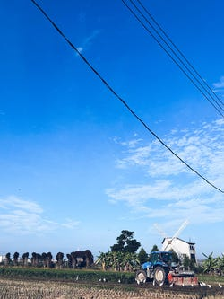
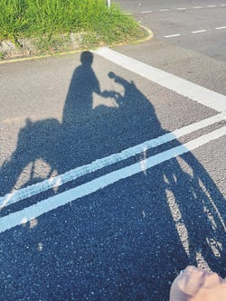
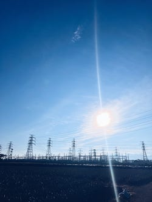

# 魂論
我們是靈魂，而擁有軀殼
親愛的安納莉絲：
時速三十三，薄霧未散，雲舒雲卷，恬然自得的心情縈繞在季春孟夏之際。五點三十三，騎車倘佯在阡陌田野間，拖拉機在田中穿梭攪翻著土，白鷺鷥緊跟在後頭覬覦著探頭的蠕蟲。早起的農人弓腰栽植，我猜想，汗水滴落在鳳梨之間，滋潤了整個嘉南平原。

**Yang 白鷺鷥與拖拉機**

我最喜歡的早晨是這樣的，追趕著晨曦、追尋著自我。那溫煦卻漸濃的，北回歸線的太陽。那狂狷與心怠雜揉矛盾的魂。「我們是靈魂，而擁有軀殼」不知在哪裡得來這麼一句話，在這唯物是論的天底下，大腦淪陷於科技，我們何曾思索過「我們為何是我們？」。這是我為何喜歡讀歷史的原因。我們的軀殼幫助我們帶給人生更多體驗，等待軀殼壽命將至，也該歸還蒼穹、等待下一次領略浩瀚的機會，為何將自己桎梏在五寸小盒中呢？這也是我要注意的。

**Yang 時速三十三**

曾經嚮往跫音富饒的半城繁華（或許偶爾還是如此），現在更被夾帶著雞屎味與肥料味的薰風攫心。與其在車水馬龍的街口尋找下一步，還是學會踽踽獨行讓自己脫離人龍的囹圄吧。追尋自我本就是生而為人的贈饋，爬梳尋覓自我的過程是享受的，與別人交談可以了解你們，與自己交談可以了解你。我知道我會害怕孤單，大家都會，不如就多與書中的人對話吧。
曾經走到書店只會看搶救國文大作戰、生物upup等。到了大學才有些時間思考自己想要什麼，從某次失戀開始，閱讀習慣一直陪伴著，從那種bullshit雞湯類文本，到企業創業、歷史、股票市場、甲蟲等等包羅萬象。透過走進書店，才知道當下的你最渴望哪方面的知識或是心態。你會渴、靈魂也會渴。不如點杯咖啡，坐下來看看人來人往，滋養一下。
認識我的人或許會驚覺，我平時為人與文案風格甚有落差，我是個矛盾的人，你看到的是我、你讀到的也是我，看起來像不同人，實際上也是不同人…人群裡與獨處時是迥然的倆人。光是同一篇文章，就可能出現兩種文筆。或許是我左腦是一個人，右腦又是另一個吧。

**Yang 鐵塔與太陽**

開始寫作的原因，一覺起來驚覺已經過弱冠有二年有餘，好似大夢方醒，原來我已經不再是活在媽媽裙擺後的小男生了。在這裡以隨便的方式記錄，可能是日記、散文、新詩等格式，隨意。有靈感再寫，沒有就別瞎亂填。希望我的文案是那種不落俗套，越奇怪越好的文章。故事裡的人物也忌直言名諱，讓名字轉化成虛幻遐想的留白空間，我們在彼岸明白那是你，還有你，還有你…
待我老了也好記得我是如何走到此的，我老了的時候也知道我此刻為何是我，我預想那老人大概是個陶情適性的老番顛哈哈。

Yang
